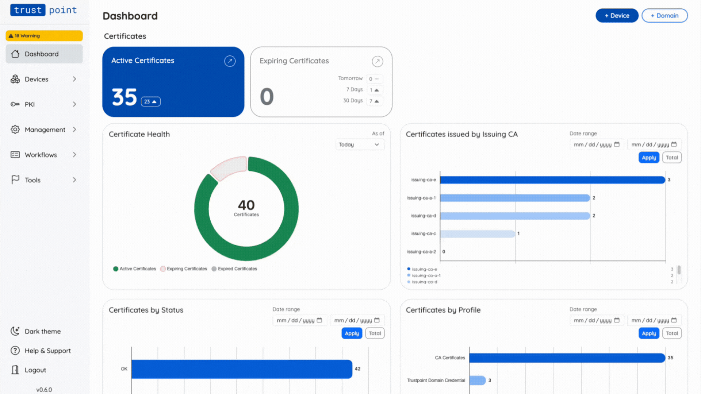

<div align="center">

# Trustpoint

### Open-source machine identity management for industrial systems

**Automate certificate onboarding, renewal, and lifecycle management for machines and industrial devices.**

Trustpoint is an open-source PKI and machine identity platform built for operational technology (OT). It helps machine builders, operators, and integrators manage X.509 identities across long-lived, segmented, and heterogeneous industrial environments.

[**Get Started**](#quickstart) · [**Documentation**](https://trustpoint.readthedocs.io/en/latest/) · [**Latest Release**](https://github.com/Trustpoint-Project/trustpoint/releases/latest) · [**Website**](https://industrial-security.io)

[](https://github.com/Trustpoint-Project/trustpoint/stargazers)
[](https://github.com/Trustpoint-Project/trustpoint)
[](LICENSE)
[](https://trustpoint.readthedocs.io)
[](https://hub.docker.com/r/trustpointproject/trustpoint)
[](https://www.bestpractices.dev/projects/11535)

[](https://github.com/Trustpoint-Project/trustpoint/actions/workflows/pytest.yml)
[](https://codecov.io/gh/Trustpoint-Project/trustpoint)
[](https://github.com/Trustpoint-Project/trustpoint/actions/workflows/mypy.yml)
[](https://github.com/Trustpoint-Project/trustpoint/actions/workflows/ruff.yml)

</div>

<p align="center">
  
</p>

> [!CAUTION]
> Trustpoint is currently a **technology preview (beta)** and is **not intended for production use**.

<!--
Recommended: add a short 15-30 second GIF here showing:
1. Add/onboard a device
2. Issue a certificate
3. View it in the dashboard
4. Show an automated renewal
Example:
<p align="center">
  
</p>
-->

## Why Trustpoint?

Industrial systems increasingly depend on digital identities, but certificate management in OT is often still manual, fragmented, and difficult to automate.

Machines may remain in service for decades. Networks are segmented. Devices vary widely in capability. Existing IT-centric identity workflows do not always translate cleanly to the factory floor.

Trustpoint provides a unified, open platform for **machine identity and certificate lifecycle management in OT**.

| The challenge | With Trustpoint |
| --- | --- |
| Manual certificate provisioning | Automated onboarding, enrollment, renewal, and re-enrollment |
| Fragmented certificate silos | Centralized identity and certificate lifecycle management |
| Different device capabilities | Multiple enrollment protocols and authentication methods |
| Vendor-specific workflows | Open standards, APIs, and an open-source foundation |
| PKI complexity | Web-based workflows and abstractions for industrial users |
| Long-lived devices | Lifecycle-oriented certificate management and renewal automation |

Trustpoint is designed to help you:

- **Onboard machines securely** using zero-touch, semi-automated, or operator-driven workflows.
- **Automate certificate lifecycles** from initial enrollment through renewal, rekeying, and revocation.
- **Integrate with existing PKI** by operating as a Certificate Authority (CA) or Registration Authority (RA).
- **Use open protocols** including EST, CMP, and OPC UA GDS Push.
- **Automate industrial workflows** through REST APIs, agents, webhooks, and approval steps.
- **Protect cryptographic keys** with PKCS#11-compatible HSM integration.
- **Avoid vendor lock-in** through interoperable protocols and an MIT-licensed open-source codebase.

## Quickstart

The fastest way to explore Trustpoint is the guided setup wizard on a **Linux host**.

### Prerequisites

- Docker 20.10+
- Docker Compose 2.32.4+
- Git

### Start Trustpoint

```bash
git clone https://github.com/Trustpoint-Project/trustpoint.git
cd trustpoint
./tp_wizard.sh
```

The wizard guides you through the Docker-based setup. It keeps repository
`.env` unchanged and writes generated runtime values to `.env.tp_wizard`.

For repeatable demo environments:

```bash
./tp_wizard.sh demo light
./tp_wizard.sh demo
./tp_wizard.sh demo full --skip-setup
```

`demo light` starts Trustpoint and PostgreSQL. `demo` adds Mailpit and SFTPGo.
`demo full` also starts Prometheus and Grafana, with the Trustpoint metrics
endpoint enabled and provisioned. Workflows2 is never started by default;
add it explicitly with `./tp_wizard.sh up worker`.

Useful lifecycle commands:

```bash
./tp_wizard.sh status
./tp_wizard.sh logs trustpoint
./tp_wizard.sh down
./tp_wizard.sh nuke
```

The wizard also recognizes the services from this repository's
`docker-compose.yml`, so `down` and `nuke` remove Compose-created containers
and workers as well as wizard-created containers. Run `./tp_wizard.sh demo help`
for the preset details.


Then open:

```text
http://localhost
```

The initial setup wizard generates a TLS certificate. 

> [!NOTE]
> You find the default initial credentials in the Docker logs.

Want the full setup flow? See the **[Quickstart Setup Guide](https://trustpoint.readthedocs.io/en/latest/getting_started/quickstart_setup.html)**.

## What can Trustpoint do?

### Machine identity lifecycle

Trustpoint manages digital identities and X.509 certificates across the device lifecycle:

```text
Device / Machine
      │
      ▼
  Onboarding
      │
      ▼
Initial Device Identity
      │
      ▼
Application Certificates
      │
      ├──► Renewal / Rekeying
      │
      ├──► Revocation
      │
      └──► Decommissioning
```

### Enrollment and onboarding protocols

| Method | Typical use | Authentication / trust | Lifecycle capabilities |
| --- | --- | --- | --- |
| **AOKI** *(proof of concept)* | Zero-touch industrial device onboarding | IDevID / DevOwnerID based trust | Initial device onboarding and identity establishment |
| **EST** | Standards-based certificate enrollment | Username/password, IDevID, client certificate | Onboarding, application certificates, renewal, re-enrollment |
| **CMP** | Flexible enrollment for industrial or constrained devices | Shared secret, IDevID, client certificate | Onboarding, enrollment, renewal, rekeying |
| **OPC UA GDS Push** | OPC UA certificate and trust-list distribution | Secure device registration and certificate authentication | Server certificate and trust-anchor distribution, cyclic updates |
| **Manual / remote download** | Operator-driven or browser-assisted issuance | Operator workflow / one-time password | PKCS#12 or PEM credential delivery |

Learn more:

- [AOKI — Automated Onboarding Key Infrastructure](https://trustpoint.readthedocs.io/en/latest/features/aoki/index.html)
- [EST API documentation](https://trustpoint.readthedocs.io/en/latest/features/apis/est.html)
- [CMP API documentation](https://trustpoint.readthedocs.io/en/latest/features/apis/cmp.html)
- [OPC UA GDS Push specification](https://reference.opcfoundation.org/GDS/v105/docs/7.4)

## Core capabilities

### Automated certificate management

- Certificate enrollment and issuance
- Renewal and re-enrollment
- Rekeying
- Certificate revocation
- Cyclic CRL generation
- JSON-based certificate profiles
- Certificate discovery

### Trustpoint Agents

Trustpoint Agents automate certificate lifecycle workflows on or near industrial devices.

Agents can:

- automate enrollment and renewal,
- communicate with Trustpoint using mTLS,
- execute reusable deployment workflows,
- deploy renewed certificates to target systems, and
- integrate with operational monitoring through structured logs.

See the **[Trustpoint Agents documentation](https://trustpoint.readthedocs.io/en/latest/features/devices/agents.html)**.

### PKI integration

Trustpoint supports multiple operating models:

**Certificate Authority mode**

- Import an existing issuing CA
- Create an auto-generated CA for testing
- Provide CA certificates to devices through EST or CMP
- Support CA rollover workflows

**Registration Authority mode**

- Forward EST enrollment requests to an external CA
- Integrate Trustpoint workflows with an existing PKI

### HSM and key protection

Trustpoint supports **PKCS#11-based HSM integration** for cryptographic key storage and operations.

For local development, Trustpoint can use a dedicated SoftHSM container through the setup wizard.

### APIs and headless integration

Trustpoint provides REST APIs for machine identity and certificate workflows, including:

- certificate enrollment,
- device and identity lifecycle operations,
- onboarding configuration,
- workflow definitions, and
- system integration.

This makes it possible to integrate Trustpoint into automation pipelines, MES/ERP systems, IAM processes, or custom industrial applications.

### Workflow engine

The workflow engine supports industrial processes that require more than a simple certificate request:

- manual approval steps,
- reusable workflow definitions,
- webhook integrations,
- email notifications, and
- agent-driven certificate deployment.

### Operations and observability

Trustpoint includes:

- web-based management UI,
- dashboards,
- audit logging,
- users, roles, and organizations,
- Prometheus metrics,
- mDNS-based local service discovery,
- Docker-based deployment, and
- multi-language support.

## Built for industrial environments

Trustpoint focuses on the realities of operational technology:

- long machine and device lifecycles,
- segmented or locally connected networks,
- mixed generations of equipment,
- limited device resources,
- different levels of automation,
- existing enterprise PKI infrastructure, and
- the need to introduce machine identities without coupling them to a single vendor.

The goal is to make strong machine identities practical across brownfield and greenfield industrial environments.

## Security and compliance engineering

Security is a core part of the project.

The repository includes:

- a [Security Policy](SECURITY.md),
- OpenSSF Best Practices tracking,
- automated testing and static analysis,
- HSM integration,
- audit logging, and
- documentation related to the EU Cyber Resilience Act, including a [CRA Conformity Assessment](https://trustpoint.readthedocs.io/en/latest/cra/CRA_COMPLIANCE.html), [Threat Model](https://trustpoint.readthedocs.io/en/latest/cra/THREAT_MODEL.html), [Risk Register](https://trustpoint.readthedocs.io/en/latest/cra/RISK_REGISTER.html), and [Security Controls](https://trustpoint.readthedocs.io/en/latest/cra/CONTROLS.html).


See the **[Trustpoint documentation](https://trustpoint.readthedocs.io/en/latest/)** for the current security architecture and CRA-related material.

## Documentation

| Resource | Description |
| --- | --- |
| [Documentation](https://trustpoint.readthedocs.io/en/latest/) | Complete Trustpoint documentation |
| [Quickstart Setup](https://trustpoint.readthedocs.io/en/latest/getting_started/quickstart_setup.html) | Install and start Trustpoint |
| [Quickstart Operation](https://trustpoint.readthedocs.io/en/latest/getting_started/quickstart_operate.html) | Explore Trustpoint and issue a first certificate |
| [Trustpoint Agents](https://trustpoint.readthedocs.io/en/latest/features/devices/agents.html) | Automated certificate lifecycle management |
| [AOKI](https://trustpoint.readthedocs.io/en/latest/features/aoki/index.html) | Zero-touch device onboarding |
| [Docker Hub](https://hub.docker.com/r/trustpointproject/trustpoint) | Published Trustpoint container images |
| [Releases](https://github.com/Trustpoint-Project/trustpoint/releases) | Release notes and project milestones |

## Release highlights — v0.6.0

Trustpoint v0.6.0 introduced major capabilities for machine identity automation and industrial deployment, including:

- Trustpoint Agent v1
- PKCS#11 HSM integration
- CA rollover
- users, roles, and organizations
- audit logging
- REST APIs and headless integration
- Prometheus metrics
- certificate discovery
- mDNS support
- redesigned workflow capabilities
- improved automated setup and deployment

See **[GitHub Releases](https://github.com/Trustpoint-Project/trustpoint/releases)** for the complete changelog.

## Development

Contributions are welcome.

Start with:

- [CONTRIBUTING.md](CONTRIBUTING.md)
- [CODE_OF_CONDUCT.md](CODE_OF_CONDUCT.md)
- [SECURITY.md](SECURITY.md)
- [Development documentation](https://trustpoint.readthedocs.io/en/latest/)

If you are new to the project, check the current **[issues](https://github.com/Trustpoint-Project/trustpoint/issues)** and **[discussions](https://github.com/orgs/Trustpoint-Project/discussions)**.


## Community and support

Have a question, idea, use case, or integration proposal?

- Join the **[Trustpoint Discord](https://discord.gg/6fyr3fGH)**
- Contact us at **trustpoint@campus-schwarzwald.de**
- Visit **[industrial-security.io](https://industrial-security.io)**

We are especially interested in feedback from machine builders, factory operators, system integrators, PKI teams, security researchers, and developers working on industrial identity.

## License

Trustpoint is licensed under the **[MIT License](LICENSE)**.

---

<div align="center">

### Building machine identity infrastructure for the open industrial ecosystem.

If Trustpoint is useful to your work, **[star the repository](https://github.com/Trustpoint-Project/trustpoint)** to help other industrial security developers discover it.

**[⭐ Star Trustpoint](https://github.com/Trustpoint-Project/trustpoint)**

</div>
