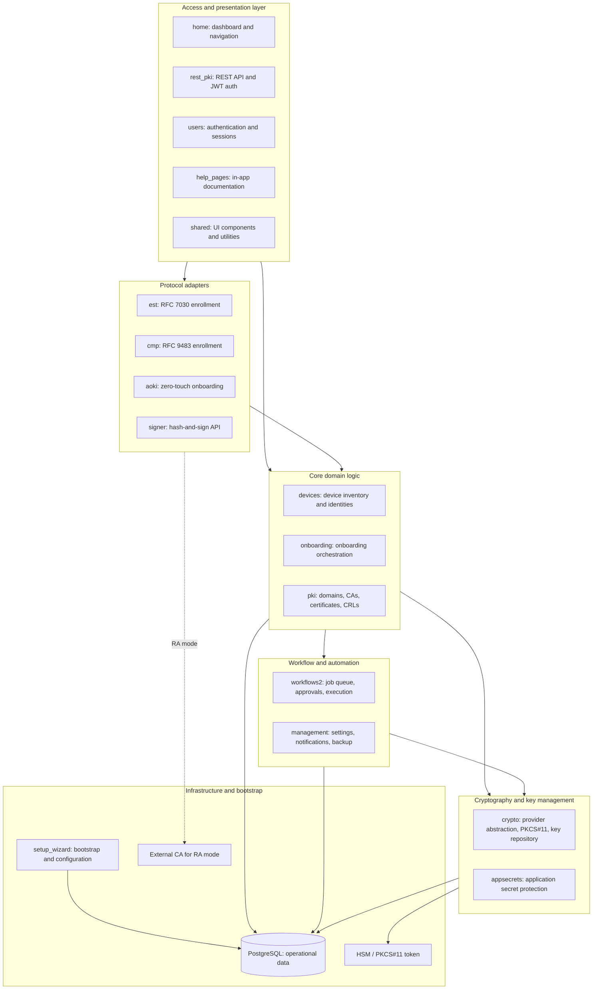

# Component Structure

Trustpoint is organized as a modular Django monolith. Each Django app represents a bounded functional area with dedicated models, views, and services.

## Logical Architecture

## Django Application Map

The following Django apps are installed and active in operational mode:

| Application | Responsibility | Key Models | Notes |
|---|---|---|---|
| `home` | Dashboard, navigation, UI entry points | — | Main user-facing UI |
| `users` | User authentication, sessions, permissions | User, Group | Django built-in with custom extensions |
| `devices` | Device inventory, credentials, remote downloads | `DeviceModel`, `RemoteDeviceCredentialDownloadModel` | Core device management |
| `onboarding` | Onboarding methods, protocols, configuration | `OnboardingConfigModel`, `OnboardingProtocol` | Device-onboarding logic |
| `pki` | Domains, CAs, certificates, CRLs, revocation | `DomainModel`, `CaModel`, `CertificateModel`, `IssuedCredentialModel`, `CrlModel` | Core PKI domain |
| `est` | EST protocol endpoints (RFC 7030) | — | Protocol adapter |
| `cmp` | CMP protocol endpoints (RFC 9483) | — | Protocol adapter |
| `aoki` | AOKI zero-touch onboarding | — | Protocol adapter |
| `signer` | Hash-and-sign signing authority | — | Signing service |
| `rest_pki` | REST API, JWT authentication, OpenAPI spec | — | External API |
| `crypto` | Cryptographic provider abstraction, PKCS#11, key management | `CryptoProviderProfileModel`, `CryptoManagedKeyModel` | Crypto backend layer |
| `appsecrets` | Application secret protection and encryption | `AppSecretModel` | Secret management |
| `workflows2` | Workflow definitions, jobs, approvals, execution | `Workflow2Instance`, `Workflow2Job`, `Workflow2Approval` | Workflow engine |
| `management` | System settings, notifications, backup, logging | `NotificationConfig`, `BackupConfig` | Operational configuration |
| `setup_wizard` | Bootstrap wizard, initial setup | — | Active only in bootstrap phase |
| `shared` | Shared UI components, utilities | — | Cross-app utilities |
| `help_pages` | In-app help and documentation | — | User assistance |

