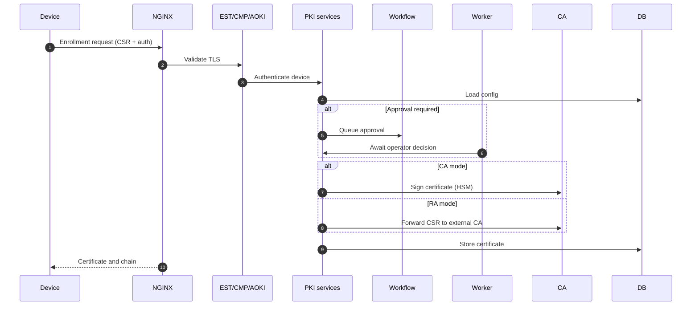
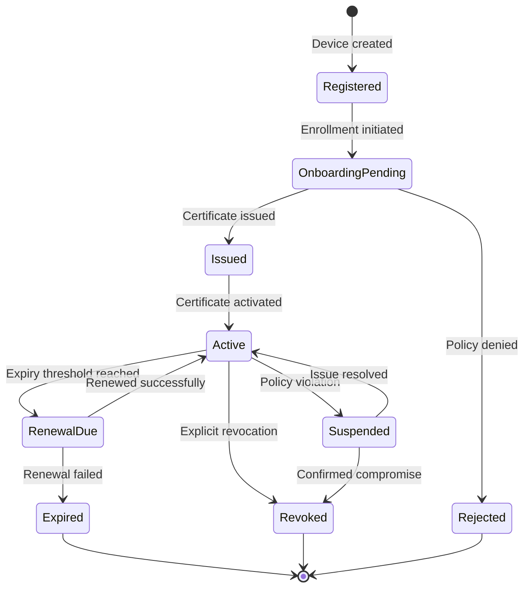

# Device Lifecycle and Certificate Management

This document describes how Trustpoint manages device identities and certificates throughout their complete lifecycle, from initial onboarding to decommissioning.

## Device Onboarding Flow

**Key steps:**
1. Device authenticates (password, client cert, or shared secret)
2. Domain policy evaluated (automatic or manual approval)
3. Certificate issued (CA mode via HSM or RA mode via external CA)
4. Certificate stored and returned to device

## Certificate Lifecycle States

| State | Description | Next States |
|-------|-------------|-------------|
| **Registered** | Device in inventory, no credential | OnboardingPending |
| **OnboardingPending** | Enrollment in progress, awaiting approval | Issued, Rejected |
| **Issued** | Certificate generated, not yet active | Active |
| **Active** | Certificate valid and in use | RenewalDue, Revoked, Suspended |
| **RenewalDue** | Approaching expiry, renewal needed | Active, Expired |
| **Expired** | Past validity period | Terminal |
| **Revoked** | Explicitly revoked, added to CRL | Terminal |
| **Suspended** | Temporarily disabled | Active, Revoked |
| **Rejected** | Enrollment denied | Terminal |

## Automated Lifecycle Management

**Certificate Expiry Monitoring:**
- Django-Q2 scheduled task runs daily
- Queries certificates approaching expiry
- Transitions to `RenewalDue` state
- Triggers renewal workflows and notifications

**CRL Generation:**
- Configurable schedule per issuing CA (minimum: 5 minutes)
- Triggered by revocation events or schedule
- Signs CRL using issuing CA key
- Publishes to HTTP endpoint (`/crl/<id>/`)

**Renewal Workflows:**
- Triggered when validity < renewal threshold
- Validates device and domain configuration
- Issues new certificate (CA or RA mode)
- Updates credential linkage
- Supports re-enrollment, rekeying, or certificate replacement

## Decommissioning Process

1. **Revoke active certificates** (via web UI or REST API)
2. **Update device status** to inactive
3. **CRL update** automatically triggered
4. **Archive device record** for audit trail
5. **Notify systems** via webhooks (optional)

**Note:** Deleting a device revokes all active certificates and triggers CRL regeneration.

## Best Practices

- Set renewal thresholds to 20-30% of certificate lifetime
- Monitor CRL distribution to relying parties
- Automate renewal to prevent expiry
- Test decommissioning procedures regularly
- Implement webhook integrations for inventory synchronization
- Review approval workflows regularly
- Maintain up-to-date device inventory
- Plan for certificate rollover events
- Archive historical credentials for compliance
- Monitor lifecycle metrics (enrollment rates, renewal rates, revocations)
