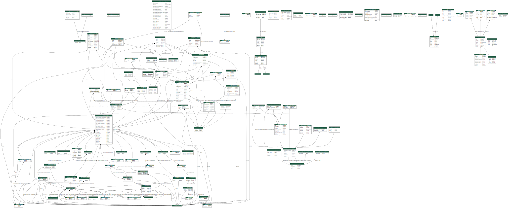

Model Relationships
===================

Complete Model Diagram
----------------------

This diagram shows all Django models and their relationships across the Trustpoint application.

**Legend:**

- **Boxes** represent Django models
- **Solid arrows** indicate ForeignKey relationships
- **Dashed arrows** indicate ManyToMany relationships
- **Colors** group models by application

Model Index by Application
---------------------------

appsecrets
^^^^^^^^^^

**AppSecretBackendModel**

   *app secret backend model*

   Database table: ``app_secret_backend``

   Relationships:

   - ``pkcs11_config`` (OneToOneRel) → appsecrets.AppSecretPkcs11ConfigModel
   - ``software_config`` (OneToOneRel) → appsecrets.AppSecretSoftwareConfigModel

**AppSecretPkcs11ConfigModel**

   *app secret pkcs11 config model*

   Database table: ``app_secret_pkcs11_config``

   Relationships:

   - ``backend`` (OneToOneField) → appsecrets.AppSecretBackendModel

**AppSecretSoftwareConfigModel**

   *app secret software config model*

   Database table: ``app_secret_software_config``

   Relationships:

   - ``backend`` (OneToOneField) → appsecrets.AppSecretBackendModel

cmp
^^^

**CmpTransactionModel**

   *cmp transaction model*

   Database table: ``cmp_cmptransactionmodel``

   Relationships:

   - ``device`` (ForeignKey) → devices.DeviceModel
   - ``domain`` (ForeignKey) → pki.DomainModel
   - ``final_certificate`` (ForeignKey) → pki.CertificateModel
   - ``issuer_credential`` (ForeignKey) → pki.CredentialModel

crypto
^^^^^^

**CryptoManagedKeyModel**

   *crypto managed key model*

   Database table: ``crypto_managed_key``

   Relationships:

   - ``credentialmodel`` (ManyToOneRel) → pki.CredentialModel
   - ``pkcs11_binding`` (OneToOneRel) → crypto.CryptoManagedKeyPkcs11BindingModel
   - ``software_binding`` (OneToOneRel) → crypto.CryptoManagedKeySoftwareBindingModel
   - ``rest_binding`` (OneToOneRel) → crypto.CryptoManagedKeyRestBindingModel
   - ``provider_profile`` (ForeignKey) → crypto.CryptoProviderProfileModel

**CryptoManagedKeyPkcs11BindingModel**

   *crypto managed key pkcs11 binding model*

   Database table: ``crypto_managed_key_pkcs11_binding``

   Relationships:

   - ``managed_key`` (OneToOneField) → crypto.CryptoManagedKeyModel
   - ``provider_profile`` (ForeignKey) → crypto.CryptoProviderProfileModel

**CryptoManagedKeyRestBindingModel**

   *crypto managed key rest binding model*

   Database table: ``crypto_managed_key_rest_binding``

   Relationships:

   - ``managed_key`` (OneToOneField) → crypto.CryptoManagedKeyModel
   - ``provider_profile`` (ForeignKey) → crypto.CryptoProviderProfileModel

**CryptoManagedKeySoftwareBindingModel**

   *crypto managed key software binding model*

   Database table: ``crypto_managed_key_software_binding``

   Relationships:

   - ``managed_key`` (OneToOneField) → crypto.CryptoManagedKeyModel
   - ``provider_profile`` (ForeignKey) → crypto.CryptoProviderProfileModel

**CryptoProviderCapabilityPkcs11DetailModel**

   *crypto provider capability pkcs11 detail model*

   Database table: ``crypto_provider_capability_pkcs11_detail``

   Relationships:

   - ``snapshot`` (OneToOneField) → crypto.CryptoProviderCapabilitySnapshotModel

**CryptoProviderCapabilityRestDetailModel**

   *crypto provider capability rest detail model*

   Database table: ``crypto_provider_capability_rest_detail``

   Relationships:

   - ``snapshot`` (OneToOneField) → crypto.CryptoProviderCapabilitySnapshotModel

**CryptoProviderCapabilitySnapshotModel**

   *crypto provider capability snapshot model*

   Database table: ``crypto_provider_capability_snapshot``

   Relationships:

   - ``pkcs11_detail`` (OneToOneRel) → crypto.CryptoProviderCapabilityPkcs11DetailModel
   - ``software_detail`` (OneToOneRel) → crypto.CryptoProviderCapabilitySoftwareDetailModel
   - ``rest_detail`` (OneToOneRel) → crypto.CryptoProviderCapabilityRestDetailModel
   - ``profile`` (ForeignKey) → crypto.CryptoProviderProfileModel

**CryptoProviderCapabilitySoftwareDetailModel**

   *crypto provider capability software detail model*

   Database table: ``crypto_provider_capability_software_detail``

   Relationships:

   - ``snapshot`` (OneToOneField) → crypto.CryptoProviderCapabilitySnapshotModel

**CryptoProviderPkcs11ConfigModel**

   *crypto provider pkcs11 config model*

   Database table: ``crypto_provider_pkcs11_config``

   Relationships:

   - ``profile`` (OneToOneField) → crypto.CryptoProviderProfileModel

**CryptoProviderProfileModel**

   *crypto provider profile model*

   Database table: ``crypto_provider_profile``

   Relationships:

   - ``pkcs11_config`` (OneToOneRel) → crypto.CryptoProviderPkcs11ConfigModel
   - ``software_config`` (OneToOneRel) → crypto.CryptoProviderSoftwareConfigModel
   - ``rest_config`` (OneToOneRel) → crypto.CryptoProviderRestConfigModel
   - ``managed_keys`` (ManyToOneRel) → crypto.CryptoManagedKeyModel
   - ``pkcs11_key_bindings`` (ManyToOneRel) → crypto.CryptoManagedKeyPkcs11BindingModel
   - ``software_key_bindings`` (ManyToOneRel) → crypto.CryptoManagedKeySoftwareBindingModel
   - ``rest_key_bindings`` (ManyToOneRel) → crypto.CryptoManagedKeyRestBindingModel
   - ``capability_snapshots`` (ManyToOneRel) → crypto.CryptoProviderCapabilitySnapshotModel
   - ``current_capability_snapshot`` (ForeignKey) → crypto.CryptoProviderCapabilitySnapshotModel

**CryptoProviderRestConfigModel**

   *crypto provider rest config model*

   Database table: ``crypto_provider_rest_config``

   Relationships:

   - ``profile`` (OneToOneField) → crypto.CryptoProviderProfileModel

**CryptoProviderSoftwareConfigModel**

   *crypto provider software config model*

   Database table: ``crypto_provider_software_config``

   Relationships:

   - ``profile`` (OneToOneField) → crypto.CryptoProviderProfileModel

devices
^^^^^^^

**DeviceModel**

   *device model*

   Database table: ``devices_devicemodel``

   Relationships:

   - ``remotedevicecredentialdownloadmodel`` (ManyToOneRel) → devices.RemoteDeviceCredentialDownloadModel
   - ``issued_credentials`` (ManyToOneRel) → pki.IssuedCredentialModel
   - ``remote_issued_credentials`` (ManyToOneRel) → pki.RemoteIssuedCredentialModel
   - ``cmp_transactions`` (ManyToOneRel) → cmp.CmpTransactionModel
   - ``notifications`` (ManyToOneRel) → management.NotificationModel
   - ``domain`` (ForeignKey) → pki.DomainModel
   - ``onboarding_config`` (ForeignKey) → onboarding.OnboardingConfigModel
   - ``no_onboarding_config`` (ForeignKey) → onboarding.NoOnboardingConfigModel

**RemoteDeviceCredentialDownloadModel**

   *remote device credential download model*

   Database table: ``devices_remotedevicecredentialdownloadmodel``

   Relationships:

   - ``issued_credential_model`` (OneToOneField) → pki.IssuedCredentialModel
   - ``device`` (ForeignKey) → devices.DeviceModel

management
^^^^^^^^^^

**AppVersion**

   *App Version*

   Database table: ``management_appversion``

**AuditLog**

   *Audit Log Entry*

   Database table: ``management_auditlog``

   Relationships:

   - ``target_content_type`` (ForeignKey) → contenttypes.ContentType
   - ``actor`` (ForeignKey) → auth.User

**BackupOptions**

   *Backup Option*

   Database table: ``management_backupoptions``

**InternationalizationConfig**

   *internationalization config*

   Database table: ``management_internationalizationconfig``

**LoggingConfig**

   *logging config*

   Database table: ``management_loggingconfig``

**NotificationConfig**

   *Notification Configuration*

   Database table: ``management_notificationconfig``

**NotificationMessageModel**

   *notification message model*

   Database table: ``management_notificationmessagemodel``

   Relationships:

   - ``notifications`` (ManyToOneRel) → management.NotificationModel

**NotificationModel**

   *notification model*

   Database table: ``management_notificationmodel``

   Relationships:

   - ``domain`` (ForeignKey) → pki.DomainModel
   - ``certificate`` (ForeignKey) → pki.CertificateModel
   - ``device`` (ForeignKey) → devices.DeviceModel
   - ``issuing_ca`` (ForeignKey) → pki.CaModel
   - ``message`` (ForeignKey) → management.NotificationMessageModel
   - ``statuses`` (ManyToManyField) → management.NotificationStatus

**NotificationStatus**

   *notification status*

   Database table: ``management_notificationstatus``

   Relationships:

   - ``notifications`` (ManyToManyRel) → management.NotificationModel

**PrometheusConfig**

   *Prometheus Configuration*

   Database table: ``management_prometheusconfig``

**SecurityConfig**

   *security config*

   Database table: ``management_securityconfig``

**SmtpEmailConfig**

   *SMTP Email Configuration*

   Database table: ``management_smtpemailconfig``

**TlsSettings**

   *tls settings*

   Database table: ``management_tlssettings``

**UIConfig**

   *ui config*

   Database table: ``management_uiconfig``

**WeakECCCurve**

   *weak ecc curve*

   Database table: ``management_weakecccurve``

**WeakSignatureAlgorithm**

   *weak signature algorithm*

   Database table: ``management_weaksignaturealgorithm``

**WorkflowExecutionConfig**

   *workflow execution config*

   Database table: ``management_workflowexecutionconfig``

onboarding
^^^^^^^^^^

**NoOnboardingConfigModel**

   *no onboarding config model*

   Database table: ``onboarding_noonboardingconfigmodel``

   Relationships:

   - ``device`` (ManyToOneRel) → devices.DeviceModel
   - ``owner_credentials`` (ManyToOneRel) → pki.OwnerCredentialModel
   - ``remote_cas`` (ManyToOneRel) → pki.CaModel
   - ``trust_store`` (ForeignKey) → pki.TruststoreModel

**OnboardingConfigModel**

   *onboarding config model*

   Database table: ``onboarding_onboardingconfigmodel``

   Relationships:

   - ``device`` (ManyToOneRel) → devices.DeviceModel
   - ``owner_credentials`` (ManyToOneRel) → pki.OwnerCredentialModel
   - ``remote_cas`` (ManyToOneRel) → pki.CaModel
   - ``idevid_trust_store`` (ForeignKey) → pki.TruststoreModel
   - ``trust_store`` (ForeignKey) → pki.TruststoreModel
   - ``opc_trust_store`` (ForeignKey) → pki.TruststoreModel

pki
^^^

**AccessDescriptionModel**

   *access description model*

   Database table: ``pki_accessdescriptionmodel``

   Relationships:

   - ``authority_info_access_syntax`` (ManyToManyRel) → pki.AuthorityInformationAccessExtension
   - ``subject_info_access_syntax`` (ManyToManyRel) → pki.SubjectInformationAccessExtension
   - ``access_location`` (ForeignKey) → pki.GeneralNameModel

**ActiveTrustpointTlsServerCredentialModel**

   *active trustpoint tls server credential model*

   Database table: ``pki_activetrustpointtlsservercredentialmodel``

   Relationships:

   - ``credential`` (ForeignKey) → pki.CredentialModel

**AttributeTypeAndValue**

   *attribute type and value*

   Database table: ``pki_attributetypeandvalue``

   Relationships:

   - ``generalnamedirectoryname`` (ManyToManyRel) → pki.GeneralNameDirectoryName
   - ``distribution_point_name`` (ManyToManyRel) → pki.DistributionPointName
   - ``subjectdirectoryattributesextension`` (ManyToManyRel) → pki.SubjectDirectoryAttributesExtension
   - ``issuer`` (ManyToManyRel) → pki.CertificateModel
   - ``subject`` (ManyToManyRel) → pki.CertificateModel

**AuthorityInformationAccessExtension**

   *authority information access extension*

   Database table: ``pki_authorityinformationaccessextension``

   Relationships:

   - ``certificatemodel`` (ManyToOneRel) → pki.CertificateModel
   - ``authority_info_access_syntax`` (ManyToManyField) → pki.AccessDescriptionModel

**AuthorityKeyIdentifierExtension**

   *authority key identifier extension*

   Database table: ``pki_authoritykeyidentifierextension``

   Relationships:

   - ``certificates`` (ManyToOneRel) → pki.CertificateModel
   - ``authority_cert_issuer`` (ForeignKey) → pki.GeneralNamesModel

**BasicConstraintsExtension**

   *basic constraints extension*

   Database table: ``pki_basicconstraintsextension``

   Relationships:

   - ``certificates`` (ManyToOneRel) → pki.CertificateModel

**CPSUriModel**

   *cps uri model*

   Database table: ``pki_cpsurimodel``

   Relationships:

   - ``qualifiers`` (ManyToOneRel) → pki.QualifierModel

**CaModel**

   *Certificate Authority*

   Database table: ``pki_genericcamodel``

   Relationships:

   - ``revoked_certificates`` (ManyToOneRel) → pki.RevokedCertificateModel
   - ``crls`` (ManyToOneRel) → pki.CrlModel
   - ``remote_issued_credentials`` (ManyToOneRel) → pki.RemoteIssuedCredentialModel
   - ``child_cas`` (ManyToOneRel) → pki.CaModel
   - ``domains`` (ManyToOneRel) → pki.DomainModel
   - ``notifications`` (ManyToOneRel) → management.NotificationModel
   - ``parent_ca`` (ForeignKey) → pki.CaModel
   - ``certificate`` (ForeignKey) → pki.CertificateModel
   - ``credential`` (OneToOneField) → pki.CredentialModel
   - ``chain_truststore`` (OneToOneField) → pki.TruststoreModel
   - ``onboarding_config`` (ForeignKey) → onboarding.OnboardingConfigModel
   - ``no_onboarding_config`` (ForeignKey) → onboarding.NoOnboardingConfigModel

**CertificateChainOrderModel**

   *certificate chain order model*

   Database table: ``pki_certificatechainordermodel``

   Relationships:

   - ``certificate`` (ForeignKey) → pki.CertificateModel
   - ``credential`` (ForeignKey) → pki.CredentialModel
   - ``primary_certificate`` (ForeignKey) → pki.CertificateModel

**CertificateModel**

   *certificate model*

   Database table: ``pki_certificatemodel``

   Relationships:

   - ``certificatemodel`` (ManyToOneRel) → pki.CertificateModel
   - ``revoked_certificate`` (OneToOneRel) → pki.RevokedCertificateModel
   - ``credential_set`` (ManyToOneRel) → pki.CredentialModel
   - ``credential`` (ManyToManyRel) → pki.CredentialModel
   - ``credential_certificate_chains`` (ManyToManyRel) → pki.CredentialModel
   - ``primarycredentialcertificate`` (ManyToOneRel) → pki.PrimaryCredentialCertificate
   - ``certificatechainordermodel`` (ManyToOneRel) → pki.CertificateChainOrderModel
   - ``primary_certificate_set`` (ManyToOneRel) → pki.CertificateChainOrderModel
   - ``idevid_refs`` (ManyToOneRel) → pki.IDevIDReferenceModel
   - ``truststoremodel`` (ManyToManyRel) → pki.TruststoreModel
   - ``trust_store_components`` (ManyToOneRel) → pki.TruststoreOrderModel
   - ``keyless_cas`` (ManyToOneRel) → pki.CaModel
   - ``cmp_transaction_records`` (ManyToOneRel) → cmp.CmpTransactionModel
   - ``notifications`` (ManyToOneRel) → management.NotificationModel
   - ``issuer_id`` (ForeignKey) → pki.CertificateModel
   - ``key_usage_extension`` (ForeignKey) → pki.KeyUsageExtension
   - ``subject_alternative_name_extension`` (ForeignKey) → pki.SubjectAlternativeNameExtension
   - ``issuer_alternative_name_extension`` (ForeignKey) → pki.IssuerAlternativeNameExtension
   - ``basic_constraints_extension`` (ForeignKey) → pki.BasicConstraintsExtension
   - ``authority_key_identifier_extension`` (ForeignKey) → pki.AuthorityKeyIdentifierExtension
   - ``subject_key_identifier_extension`` (ForeignKey) → pki.SubjectKeyIdentifierExtension
   - ``certificate_policies_extension`` (ForeignKey) → pki.CertificatePoliciesExtension
   - ``extended_key_usage_extension`` (ForeignKey) → pki.ExtendedKeyUsageExtension
   - ``name_constraints_extension`` (ForeignKey) → pki.NameConstraintsExtension
   - ``crl_distribution_points_extension`` (ForeignKey) → pki.CrlDistributionPointsExtension
   - ``authority_information_access_extension`` (ForeignKey) → pki.AuthorityInformationAccessExtension
   - ``subject_information_access_extension`` (ForeignKey) → pki.SubjectInformationAccessExtension
   - ``inhibit_any_policy_extension`` (ForeignKey) → pki.InhibitAnyPolicyExtension
   - ``policy_constraints_extension`` (ForeignKey) → pki.PolicyConstraintsExtension
   - ``subject_directory_attributes_extension`` (ForeignKey) → pki.SubjectDirectoryAttributesExtension
   - ``freshest_crl_extension`` (ForeignKey) → pki.FreshestCrlExtension
   - ``issuer`` (ManyToManyField) → pki.AttributeTypeAndValue
   - ``subject`` (ManyToManyField) → pki.AttributeTypeAndValue

**CertificatePoliciesExtension**

   *certificate policies extension*

   Database table: ``pki_certificatepoliciesextension``

   Relationships:

   - ``certificates`` (ManyToOneRel) → pki.CertificateModel
   - ``certificate_policies`` (ManyToManyField) → pki.PolicyInformation

**CertificateProfileModel**

   *certificate profile model*

   Database table: ``pki_certificateprofilemodel``

   Relationships:

   - ``domains_as_credential_profile`` (ManyToOneRel) → pki.DomainModel
   - ``domains`` (ManyToOneRel) → pki.DomainAllowedCertificateProfileModel

**CredentialModel**

   *credential model*

   Database table: ``pki_credentialmodel``

   Relationships:

   - ``issued_credential`` (OneToOneRel) → pki.IssuedCredentialModel
   - ``remote_issued_credential`` (OneToOneRel) → pki.RemoteIssuedCredentialModel
   - ``primarycredentialcertificate`` (ManyToOneRel) → pki.PrimaryCredentialCertificate
   - ``certificatechainordermodel`` (ManyToOneRel) → pki.CertificateChainOrderModel
   - ``activetrustpointtlsservercredentialmodel`` (ManyToOneRel) → pki.ActiveTrustpointTlsServerCredentialModel
   - ``issuing_ca`` (OneToOneRel) → pki.CaModel
   - ``cmp_transaction_issuer_records`` (ManyToOneRel) → cmp.CmpTransactionModel
   - ``signer`` (OneToOneRel) → signer.SignerModel
   - ``managed_private_key`` (ForeignKey) → crypto.CryptoManagedKeyModel
   - ``certificate`` (ForeignKey) → pki.CertificateModel
   - ``certificates`` (ManyToManyField) → pki.CertificateModel
   - ``certificate_chain`` (ManyToManyField) → pki.CertificateModel

**CrlDistributionPointsExtension**

   *crl distribution points extension*

   Database table: ``pki_crldistributionpointsextension``

   Relationships:

   - ``certificates`` (ManyToOneRel) → pki.CertificateModel
   - ``distribution_points`` (ManyToManyField) → pki.DistributionPointModel

**CrlModel**

   *Certificate Revocation List*

   Database table: ``pki_crlmodel``

   Relationships:

   - ``ca`` (ForeignKey) → pki.CaModel

**DevIdRegistration**

   *dev id registration*

   Database table: ``pki_devidregistration``

   Relationships:

   - ``truststore`` (ForeignKey) → pki.TruststoreModel
   - ``domain`` (ForeignKey) → pki.DomainModel

**DistributionPointModel**

   *distribution point model*

   Database table: ``pki_distributionpointmodel``

   Relationships:

   - ``crldistributionpointsextension`` (ManyToManyRel) → pki.CrlDistributionPointsExtension
   - ``freshestcrlextension`` (ManyToManyRel) → pki.FreshestCrlExtension
   - ``distribution_point_name`` (ForeignKey) → pki.DistributionPointName
   - ``crl_issuer`` (ForeignKey) → pki.GeneralNamesModel

**DistributionPointName**

   *distribution point name*

   Database table: ``pki_distributionpointname``

   Relationships:

   - ``distributionpointmodel`` (ManyToOneRel) → pki.DistributionPointModel
   - ``full_name`` (ForeignKey) → pki.GeneralNamesModel
   - ``name_relative_to_crl_issuer`` (ManyToManyField) → pki.AttributeTypeAndValue

**DomainAllowedCertificateProfileModel**

   *domain allowed certificate profile model*

   Database table: ``pki_domainallowedcertificateprofilemodel``

   Relationships:

   - ``domain`` (ForeignKey) → pki.DomainModel
   - ``certificate_profile`` (ForeignKey) → pki.CertificateProfileModel

**DomainModel**

   *domain model*

   Database table: ``pki_domainmodel``

   Relationships:

   - ``devices`` (ManyToOneRel) → devices.DeviceModel
   - ``issued_credentials`` (ManyToOneRel) → pki.IssuedCredentialModel
   - ``remote_issued_credentials`` (ManyToOneRel) → pki.RemoteIssuedCredentialModel
   - ``certificate_profiles`` (ManyToOneRel) → pki.DomainAllowedCertificateProfileModel
   - ``devid_registrations`` (ManyToOneRel) → pki.DevIdRegistration
   - ``cmp_transactions`` (ManyToOneRel) → cmp.CmpTransactionModel
   - ``notifications`` (ManyToOneRel) → management.NotificationModel
   - ``issuing_ca`` (ForeignKey) → pki.CaModel
   - ``domain_credential_profile`` (ForeignKey) → pki.CertificateProfileModel

**ExtendedKeyUsageExtension**

   *extended key usage extension*

   Database table: ``pki_extendedkeyusageextension``

   Relationships:

   - ``certificates`` (ManyToOneRel) → pki.CertificateModel
   - ``key_purpose_ids`` (ManyToManyField) → pki.KeyPurposeIdModel

**FreshestCrlExtension**

   *freshest crl extension*

   Database table: ``pki_freshestcrlextension``

   Relationships:

   - ``certificatemodel`` (ManyToOneRel) → pki.CertificateModel
   - ``distribution_points`` (ManyToManyField) → pki.DistributionPointModel

**GeneralNameDNSName**

   *general name dns name*

   Database table: ``pki_generalnamednsname``

   Relationships:

   - ``general_names_set`` (ManyToManyRel) → pki.GeneralNamesModel
   - ``generalnamemodel`` (ManyToOneRel) → pki.GeneralNameModel

**GeneralNameDirectoryName**

   *general name directory name*

   Database table: ``pki_generalnamedirectoryname``

   Relationships:

   - ``general_names_set`` (ManyToManyRel) → pki.GeneralNamesModel
   - ``generalnamemodel`` (ManyToOneRel) → pki.GeneralNameModel
   - ``names`` (ManyToManyField) → pki.AttributeTypeAndValue

**GeneralNameIpAddress**

   *general name ip address*

   Database table: ``pki_generalnameipaddress``

   Relationships:

   - ``general_names_set`` (ManyToManyRel) → pki.GeneralNamesModel
   - ``generalnamemodel`` (ManyToOneRel) → pki.GeneralNameModel

**GeneralNameModel**

   *general name model*

   Database table: ``pki_generalnamemodel``

   Relationships:

   - ``generalsubtree`` (ManyToOneRel) → pki.GeneralSubtree
   - ``accessdescriptionmodel`` (ManyToOneRel) → pki.AccessDescriptionModel
   - ``rfc822_name`` (ForeignKey) → pki.GeneralNameRFC822Name
   - ``dns_name`` (ForeignKey) → pki.GeneralNameDNSName
   - ``directory_name`` (ForeignKey) → pki.GeneralNameDirectoryName
   - ``uri`` (ForeignKey) → pki.GeneralNameUniformResourceIdentifier
   - ``ip_address`` (ForeignKey) → pki.GeneralNameIpAddress
   - ``registered_id`` (ForeignKey) → pki.GeneralNameRegisteredId
   - ``other_name`` (ForeignKey) → pki.GeneralNameOtherName

**GeneralNameOtherName**

   *general name other name*

   Database table: ``pki_generalnameothername``

   Relationships:

   - ``general_names_set`` (ManyToManyRel) → pki.GeneralNamesModel
   - ``generalnamemodel`` (ManyToOneRel) → pki.GeneralNameModel

**GeneralNameRFC822Name**

   *general name rf c822 name*

   Database table: ``pki_generalnamerfc822name``

   Relationships:

   - ``general_names_set`` (ManyToManyRel) → pki.GeneralNamesModel
   - ``generalnamemodel`` (ManyToOneRel) → pki.GeneralNameModel

**GeneralNameRegisteredId**

   *general name registered id*

   Database table: ``pki_generalnameregisteredid``

   Relationships:

   - ``general_names_set`` (ManyToManyRel) → pki.GeneralNamesModel
   - ``generalnamemodel`` (ManyToOneRel) → pki.GeneralNameModel

**GeneralNameUniformResourceIdentifier**

   *general name uniform resource identifier*

   Database table: ``pki_generalnameuniformresourceidentifier``

   Relationships:

   - ``general_names_set`` (ManyToManyRel) → pki.GeneralNamesModel
   - ``generalnamemodel`` (ManyToOneRel) → pki.GeneralNameModel

**GeneralNamesModel**

   *general names model*

   Database table: ``pki_generalnamesmodel``

   Relationships:

   - ``issueralternativenameextension`` (ManyToOneRel) → pki.IssuerAlternativeNameExtension
   - ``subjectalternativenameextension`` (ManyToOneRel) → pki.SubjectAlternativeNameExtension
   - ``authoritykeyidentifierextension`` (ManyToOneRel) → pki.AuthorityKeyIdentifierExtension
   - ``distributionpointname`` (ManyToOneRel) → pki.DistributionPointName
   - ``distributionpointmodel`` (ManyToOneRel) → pki.DistributionPointModel
   - ``rfc822_names`` (ManyToManyField) → pki.GeneralNameRFC822Name
   - ``dns_names`` (ManyToManyField) → pki.GeneralNameDNSName
   - ``directory_names`` (ManyToManyField) → pki.GeneralNameDirectoryName
   - ``uniform_resource_identifiers`` (ManyToManyField) → pki.GeneralNameUniformResourceIdentifier
   - ``ip_addresses`` (ManyToManyField) → pki.GeneralNameIpAddress
   - ``registered_ids`` (ManyToManyField) → pki.GeneralNameRegisteredId
   - ``other_names`` (ManyToManyField) → pki.GeneralNameOtherName

**GeneralSubtree**

   *general subtree*

   Database table: ``pki_generalsubtree``

   Relationships:

   - ``permitted_subtrees_set`` (ManyToManyRel) → pki.NameConstraintsExtension
   - ``excluded_subtrees_set`` (ManyToManyRel) → pki.NameConstraintsExtension
   - ``base`` (ForeignKey) → pki.GeneralNameModel

**IDevIDReferenceModel**

   *i dev id reference model*

   Database table: ``pki_idevidreferencemodel``

   Relationships:

   - ``dev_owner_id`` (ForeignKey) → pki.OwnerCredentialModel
   - ``dev_owner_id_certificate`` (ForeignKey) → pki.CertificateModel

**InhibitAnyPolicyExtension**

   *inhibit any policy extension*

   Database table: ``pki_inhibitanypolicyextension``

   Relationships:

   - ``certificatemodel`` (ManyToOneRel) → pki.CertificateModel

**IssuedCredentialModel**

   *issued credential model*

   Database table: ``pki_issuedcredentialmodel``

   Relationships:

   - ``remotedevicecredentialdownloadmodel`` (OneToOneRel) → devices.RemoteDeviceCredentialDownloadModel
   - ``credential`` (OneToOneField) → pki.CredentialModel
   - ``device`` (ForeignKey) → devices.DeviceModel
   - ``domain`` (ForeignKey) → pki.DomainModel

**IssuerAlternativeNameExtension**

   *issuer alternative name extension*

   Database table: ``pki_issueralternativenameextension``

   Relationships:

   - ``certificates`` (ManyToOneRel) → pki.CertificateModel
   - ``issuer_alt_name`` (ForeignKey) → pki.GeneralNamesModel

**KeyPurposeIdModel**

   *key purpose id model*

   Database table: ``pki_keypurposeidmodel``

   Relationships:

   - ``extended_key_usages`` (ManyToManyRel) → pki.ExtendedKeyUsageExtension

**KeyUsageExtension**

   *key usage extension*

   Database table: ``pki_keyusageextension``

   Relationships:

   - ``certificates`` (ManyToOneRel) → pki.CertificateModel

**NameConstraintsExtension**

   *name constraints extension*

   Database table: ``pki_nameconstraintsextension``

   Relationships:

   - ``certificates`` (ManyToOneRel) → pki.CertificateModel
   - ``permitted_subtrees`` (ManyToManyField) → pki.GeneralSubtree
   - ``excluded_subtrees`` (ManyToManyField) → pki.GeneralSubtree

**NoticeReference**

   *notice reference*

   Database table: ``pki_noticereference``

   Relationships:

   - ``usernotice`` (ManyToOneRel) → pki.UserNotice

**OwnerCredentialModel**

   *owner credential model*

   Database table: ``pki_ownercredentialmodel``

   Relationships:

   - ``remote_issued_credentials`` (ManyToOneRel) → pki.RemoteIssuedCredentialModel
   - ``idevid_ref_set`` (ManyToOneRel) → pki.IDevIDReferenceModel
   - ``onboarding_config`` (ForeignKey) → onboarding.OnboardingConfigModel
   - ``no_onboarding_config`` (ForeignKey) → onboarding.NoOnboardingConfigModel

**PolicyConstraintsExtension**

   *policy constraints extension*

   Database table: ``pki_policyconstraintsextension``

   Relationships:

   - ``certificatemodel`` (ManyToOneRel) → pki.CertificateModel

**PolicyInformation**

   *policy information*

   Database table: ``pki_policyinformation``

   Relationships:

   - ``certificate_policies`` (ManyToManyRel) → pki.CertificatePoliciesExtension
   - ``policy_qualifiers`` (ManyToManyField) → pki.PolicyQualifierInfo

**PolicyMappingModel**

   *policy mapping model*

   Database table: ``pki_policymappingmodel``

   Relationships:

   - ``policy_mappings_extension`` (ManyToManyRel) → pki.PolicyMappingsExtension

**PolicyMappingsExtension**

   *policy mappings extension*

   Database table: ``pki_policymappingsextension``

   Relationships:

   - ``policy_mappings`` (ManyToManyField) → pki.PolicyMappingModel

**PolicyQualifierInfo**

   *policy qualifier info*

   Database table: ``pki_policyqualifierinfo``

   Relationships:

   - ``policies`` (ManyToManyRel) → pki.PolicyInformation
   - ``qualifier`` (ForeignKey) → pki.QualifierModel

**PrimaryCredentialCertificate**

   *primary credential certificate*

   Database table: ``pki_primarycredentialcertificate``

   Relationships:

   - ``credential`` (ForeignKey) → pki.CredentialModel
   - ``certificate`` (ForeignKey) → pki.CertificateModel

**QualifierModel**

   *qualifier model*

   Database table: ``pki_qualifiermodel``

   Relationships:

   - ``policyqualifierinfo`` (ManyToOneRel) → pki.PolicyQualifierInfo
   - ``cps_uri`` (ForeignKey) → pki.CPSUriModel
   - ``user_notice`` (ForeignKey) → pki.UserNotice

**RemoteIssuedCredentialModel**

   *remote issued credential model*

   Database table: ``pki_remoteissuedcredentialmodel``

   Relationships:

   - ``credential`` (OneToOneField) → pki.CredentialModel
   - ``ca`` (ForeignKey) → pki.CaModel
   - ``owner_credential`` (ForeignKey) → pki.OwnerCredentialModel
   - ``device`` (ForeignKey) → devices.DeviceModel
   - ``domain`` (ForeignKey) → pki.DomainModel

**RevokedCertificateModel**

   *revoked certificate model*

   Database table: ``pki_revokedcertificatemodel``

   Relationships:

   - ``certificate`` (OneToOneField) → pki.CertificateModel
   - ``ca`` (ForeignKey) → pki.CaModel

**SubjectAlternativeNameExtension**

   *subject alternative name extension*

   Database table: ``pki_subjectalternativenameextension``

   Relationships:

   - ``certificates`` (ManyToOneRel) → pki.CertificateModel
   - ``subject_alt_name`` (ForeignKey) → pki.GeneralNamesModel

**SubjectDirectoryAttributesExtension**

   *subject directory attributes extension*

   Database table: ``pki_subjectdirectoryattributesextension``

   Relationships:

   - ``certificatemodel`` (ManyToOneRel) → pki.CertificateModel
   - ``subject_directory_attributes`` (ManyToManyField) → pki.AttributeTypeAndValue

**SubjectInformationAccessExtension**

   *subject information access extension*

   Database table: ``pki_subjectinformationaccessextension``

   Relationships:

   - ``certificatemodel`` (ManyToOneRel) → pki.CertificateModel
   - ``subject_info_access_syntax`` (ManyToManyField) → pki.AccessDescriptionModel

**SubjectKeyIdentifierExtension**

   *subject key identifier extension*

   Database table: ``pki_subjectkeyidentifierextension``

   Relationships:

   - ``certificates`` (ManyToOneRel) → pki.CertificateModel

**TruststoreModel**

   *truststore model*

   Database table: ``pki_truststoremodel``

   Relationships:

   - ``idevid_onboarding_configs`` (ManyToOneRel) → onboarding.OnboardingConfigModel
   - ``onboarding_configs`` (ManyToOneRel) → onboarding.OnboardingConfigModel
   - ``opc_onboarding_configs`` (ManyToOneRel) → onboarding.OnboardingConfigModel
   - ``no_onboarding_configs`` (ManyToOneRel) → onboarding.NoOnboardingConfigModel
   - ``truststoreordermodel`` (ManyToOneRel) → pki.TruststoreOrderModel
   - ``issuing_ca`` (OneToOneRel) → pki.CaModel
   - ``devid_registrations`` (ManyToOneRel) → pki.DevIdRegistration
   - ``certificates`` (ManyToManyField) → pki.CertificateModel

**TruststoreOrderModel**

   *truststore order model*

   Database table: ``pki_truststoreordermodel``

   Relationships:

   - ``certificate`` (ForeignKey) → pki.CertificateModel
   - ``trust_store`` (ForeignKey) → pki.TruststoreModel

**UserNotice**

   *user notice*

   Database table: ``pki_usernotice``

   Relationships:

   - ``qualifiers`` (ManyToOneRel) → pki.QualifierModel
   - ``notice_ref`` (ForeignKey) → pki.NoticeReference

setup_wizard
^^^^^^^^^^^^

**SetupWizardCompletedModel**

   *setup wizard completed model*

   Database table: ``setup_wizard_setupwizardcompletedmodel``

**SetupWizardConfigModel**

   *setup wizard config model*

   Database table: ``setup_wizard_setupwizardconfigmodel``

signer
^^^^^^

**SignedMessageModel**

   *signed message model*

   Database table: ``signer_signedmessagemodel``

   Relationships:

   - ``signer`` (ForeignKey) → signer.SignerModel

**SignerModel**

   *signer model*

   Database table: ``signer_signermodel``

   Relationships:

   - ``signed_messages`` (ManyToOneRel) → signer.SignedMessageModel
   - ``credential`` (OneToOneField) → pki.CredentialModel

workflows2
^^^^^^^^^^

**Workflow2Approval**

   *workflow2 approval*

   Database table: ``workflows2_workflow2approval``

   Relationships:

   - ``instance`` (ForeignKey) → workflows2.Workflow2Instance

**Workflow2Definition**

   *workflow2 definition*

   Database table: ``workflows2_workflow2definition``

   Relationships:

   - ``instances`` (ManyToOneRel) → workflows2.Workflow2Instance
   - ``ui_states`` (ManyToOneRel) → workflows2.Workflow2DefinitionUiState

**Workflow2DefinitionUiState**

   *workflow2 definition ui state*

   Database table: ``workflows2_workflow2definitionuistate``

   Relationships:

   - ``definition`` (ForeignKey) → workflows2.Workflow2Definition

**Workflow2Instance**

   *workflow2 instance*

   Database table: ``workflows2_workflow2instance``

   Relationships:

   - ``approvals`` (ManyToOneRel) → workflows2.Workflow2Approval
   - ``runs`` (ManyToOneRel) → workflows2.Workflow2StepRun
   - ``jobs`` (ManyToOneRel) → workflows2.Workflow2Job
   - ``run`` (ForeignKey) → workflows2.Workflow2Run
   - ``definition`` (ForeignKey) → workflows2.Workflow2Definition

**Workflow2Job**

   *workflow2 job*

   Database table: ``workflows2_workflow2job``

   Relationships:

   - ``instance`` (ForeignKey) → workflows2.Workflow2Instance

**Workflow2Run**

   *workflow2 run*

   Database table: ``workflows2_workflow2run``

   Relationships:

   - ``instances`` (ManyToOneRel) → workflows2.Workflow2Instance

**Workflow2StepRun**

   *workflow2 step run*

   Database table: ``workflows2_workflow2steprun``

   Relationships:

   - ``instance`` (ForeignKey) → workflows2.Workflow2Instance

**Workflow2WorkerHeartbeat**

   *workflow2 worker heartbeat*

   Database table: ``workflows2_workflow2workerheartbeat``

