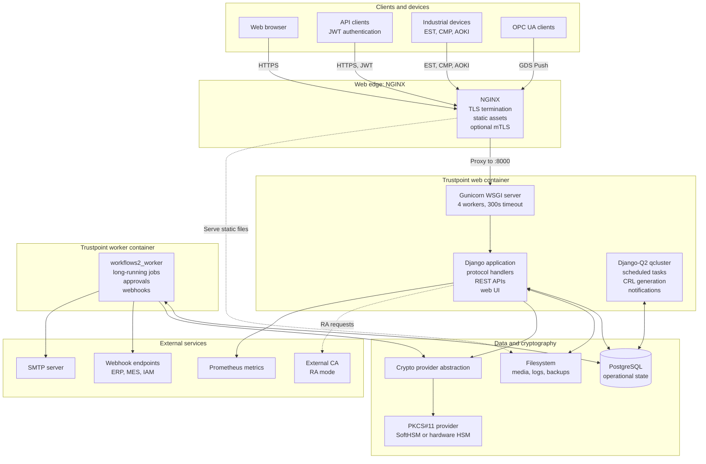
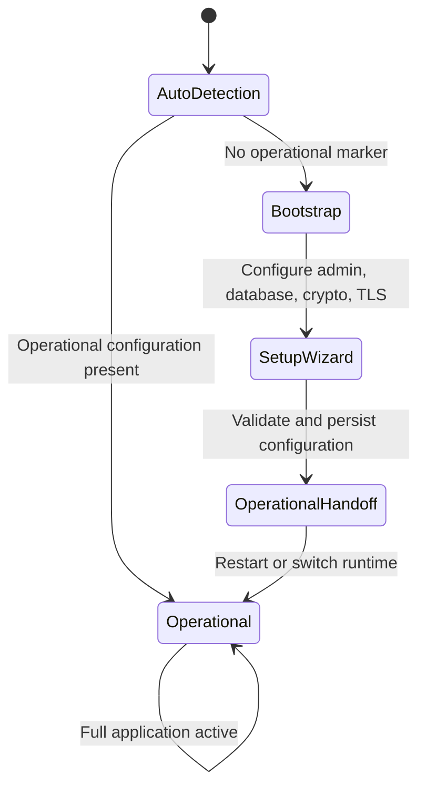

# Runtime and Container Architecture

Trustpoint is implemented as a Django application deployed in Docker containers. The standard deployment uses three containers: the main web application, a workflow worker, and a PostgreSQL database.

## Container Architecture

## Container Roles

### Trustpoint Web Container

**Processes:**

| Process | Role | Details |
|---|---|---|
| **NGINX** | TLS termination, routing | Port 80 (HTTP for CMP/CRL only), Port 443 (HTTPS, TLS 1.2/1.3), proxies to Gunicorn on 127.0.0.1:8000 |
| **Gunicorn** | WSGI server | 4 workers, 300s timeout, handles protocol endpoints, REST API, web UI |
| **Django** | Application logic | Protocol handlers, REST API, web UI views, certificate operations |
| **Django-Q2 qcluster** | Scheduled tasks | CRL generation, certificate expiry notifications, maintenance |

**Entry point:** `/docker/trustpoint/entrypoint.sh` with `TRUSTPOINT_SERVICE_ROLE=web`

### Trustpoint Worker Container

**Process:** `workflows2_worker` - Background job processor

**Responsibilities:**
- Claims jobs from database queue
- Executes approval workflows
- Calls external webhooks
- Sends email notifications
- Handles long-running certificate operations
- Lease-based job locking (default: 30 seconds)

**Entry point:** `/docker/trustpoint/entrypoint.sh` with `TRUSTPOINT_SERVICE_ROLE=worker`

### PostgreSQL Container

- Stores all operational data (devices, certificates, domains, workflows, users)
- Listens on `127.0.0.1:5432` (not exposed to external network)
- Data persisted in `postgres_data` Docker volume

## Bootstrap vs Operational Phases

Trustpoint operates in two distinct phases:

### Phase Comparison

| Aspect | Bootstrap Phase | Operational Phase |
|---|---|---|
| **Purpose** | Initial setup and configuration | Normal production operation |
| **Active when** | No operational config file, first-time deployment | Operational config exists, `TRUSTPOINT_PHASE=operational/auto` |
| **Features** | Setup wizard UI, bootstrap SQLite DB, TLS cert generation, minimal routes | Full functionality, protocol endpoints, REST API, workflows |
| **Services** | Web container only | All three containers (web, worker, postgres) |
| **Database** | SQLite (temporary) | PostgreSQL |

### Phase Transition

**Phase detection logic:**
1. Check `TRUSTPOINT_PHASE` environment variable
2. If `auto`, check for operational marker files (`/var/lib/trustpoint/bootstrap/operational.env`, `operational.ready`)
3. Files exist → operational phase; otherwise → bootstrap phase

**Security benefit:** Limits exposed endpoints until system is properly configured.
