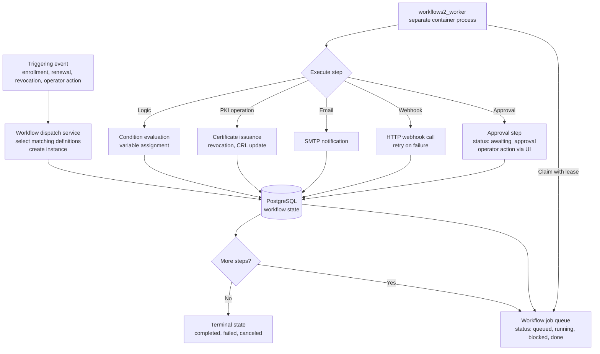

# Workflow Architecture

Long-running operations (approvals, external CA requests, webhooks, notifications) are executed asynchronously by the `workflows2_worker` process. This keeps protocol responses fast and allows retries, manual intervention, and external system integration.

## Workflow Execution Flow

## Workflow Components

### 1. Workflow Definitions

**Location:** `trustpoint/workflows2/definitions/` (YAML files)

**Purpose:** Define reusable workflow templates

**Structure:** YAML files with events, steps, conditions, and actions

**Compilation:** YAML compiled to internal representation (IR), stored in `Workflow2Definition` model

**Module:** `workflows2/services/definitions.py`

### 2. Dispatch Service

**Purpose:** Match events to workflow definitions and create instances

**Module:** `workflows2/services/dispatch.py`

**Process:**
1. Event occurs (e.g., device enrollment request)
2. Query matching workflow definitions
3. Create `Workflow2Instance` for each match
4. Create initial `Workflow2Job` in queued state

### 3. Job Queue

**Model:** `Workflow2Job`

**Key fields:**
- `status`: `queued`, `running`, `done`, `failed`
- `locked_until`: Lease expiry timestamp
- `locked_by`: Worker ID holding lease
- `retry_count`: Number of retry attempts
- `last_error`: Last error message

**Job lifecycle:** `queued → running → done` (or `failed → queued` for retry)

**Lease mechanism:**
- Worker claims job with 30-second lease (default)
- Heartbeat extends lease for long-running steps
- Stale jobs (lease expired) recovered by worker

### 4. Worker Process

**Command:** `python manage.py workflows2_worker`

**Container:** `trustpoint-worker`

**Implementation:** `workflows2/services/worker.py`

**Worker loop:**
1. Recover stale jobs (lease expired)
2. Claim up to batch_limit jobs
3. Process each job
4. Create next job if more steps remain

**Failure handling:**
- Failed jobs retry with exponential backoff (1m, 2m, 4m, 8m, 16m, 32m max)
- Max retries: 6 (configurable)
- Error message stored in `last_error`

**Stale job recovery:**
- Query jobs with `status=running` and `locked_until < now()`
- Mark as `failed` with "Lease expired" error
- Schedule retry

### 5. Runtime Service

**Purpose:** Execute workflow steps and maintain execution state

**Module:** `workflows2/services/runtime.py`

**Key responsibilities:**
- Load workflow IR (internal representation)
- Execute one step at a time (checkpointed execution)
- Evaluate conditions and expressions
- Handle approval steps
- Persist execution state after each step

### 6. Execution Engine

**Module:** `workflows2/engine/executor.py`

**Supported step types:**

| Step Type | Purpose | Key Features |
|---|---|---|
| **set** | Variable assignment | Template expressions, context variables |
| **logic** | Conditional branching | If/then/else, condition evaluation |
| **approval** | Manual approval gate | Timeout support, approval groups, status tracking |
| **webhook** | HTTP webhook call | Retry on failure, custom headers, timeout |
| **email** | Email notification | Template support, SMTP integration |
| **pki.*** | PKI operations | Certificate issuance, revocation, CRL generation |

**Approval mechanism:**
- Sets instance status to `awaiting_approval`
- Creates `Workflow2Approval` record
- Worker pauses execution
- Operator approves/rejects via web UI
- Worker resumes after resolution

### 7. Approval Mechanism

**Model:** `Workflow2Approval`

**Key fields:**
- `status`: `pending`, `approved`, `rejected`, `expired`
- `requested_by`: User who initiated workflow
- `resolved_by`: User who approved/rejected
- `resolved_at`: Resolution timestamp
- `resolution_note`: Optional justification

**Approval UI:** `workflows2/views/approvals.py`

**Timeout handling:** Django-Q2 scheduled task checks expired approvals

## Worker Deployment

### Command-Line Options

| Option | Default | Description |
|---|---|---|
| `--id <worker_id>` | hostname | Worker identifier |
| `--lease <seconds>` | 30 | Job lease duration |
| `--batch <count>` | 10 | Batch size per tick |
| `--sleep <seconds>` | 1.0 | Sleep between ticks |
| `--once` | - | Run one tick and exit (debug) |

### Multiple Workers

Multiple worker containers can run concurrently for:
- Parallel job processing
- High availability (worker failures don't block queue)
- Horizontal scaling

**Coordination:** PostgreSQL row-level locking (`SELECT FOR UPDATE`), lease-based job ownership

### Worker Monitoring

**Heartbeat:**
- Workers write heartbeat every 5 seconds
- Stale heartbeats (>60s old) indicate crashed worker

**Metrics:**
- Jobs claimed/processed/skipped per tick
- Stale jobs recovered
- Current queue depth

## Workflow vs Scheduled Tasks

Trustpoint uses two separate background processing systems:

| Aspect | Workflow Engine (`workflows2_worker`) | Scheduled Tasks (Django-Q2 `qcluster`) |
|---|---|---|
| **Purpose** | Long-running, event-driven operations | Periodic maintenance tasks |
| **Execution** | Job queue, lease-based | Scheduled (cron-like) |
| **Container** | Separate worker container | Web container |
| **Features** | Approval gates, retry with backoff | Simple retry logic |
| **Use cases** | Device onboarding approvals, external CA requests, webhooks | CRL generation, certificate expiry checks, cleanup |

## Example Workflows

### Device Onboarding with Approval

**Steps:**
1. Validate device (check IDevID)
2. Request approval from operators (24h timeout)
3. Issue certificate
4. Notify ERP via webhook
5. Email administrator

### Certificate Renewal

**Steps:**
1. Check device is active
2. Renew certificate
3. Notify device contact via email

### Certificate Revocation

**Steps:**
1. Revoke certificate
2. Regenerate CRL
3. Notify monitoring system via webhook

## Best Practices

1. **Keep steps atomic** - Each step should be idempotent
2. **Use approval gates wisely** - Only for operations requiring human judgment
3. **Implement retry logic** - External calls should be retryable
4. **Monitor queue depth** - Alert when queue grows beyond normal
5. **Set appropriate timeouts** - Prevent workflows from blocking indefinitely
6. **Log workflow context** - Include sufficient detail for troubleshooting
7. **Handle failures gracefully** - Define fallback steps and error handling

## Troubleshooting

| Issue | Solution |
|---|---|
| **Queue not processing** | Check worker container status, logs, PostgreSQL connection, heartbeats |
| **Jobs failing repeatedly** | Check `Workflow2Job.last_error`, verify external service availability |
| **Approvals not appearing** | Verify `Workflow2Approval` records, check permissions, review step config |
| **Slow job processing** | Increase worker batch size, add more workers, optimize queries |
| **Stale jobs accumulating** | Increase lease duration, investigate crashes, check for deadlocks |
