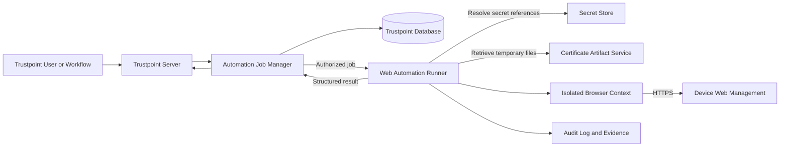
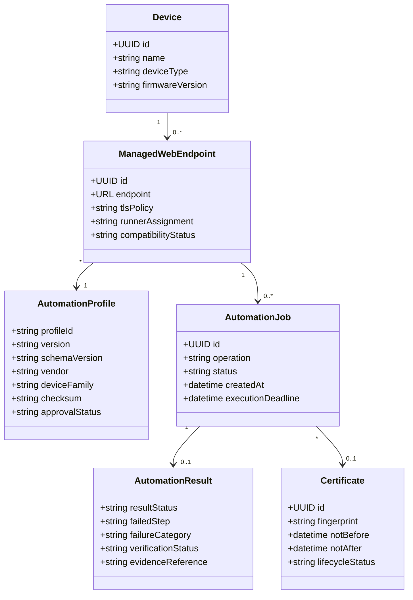
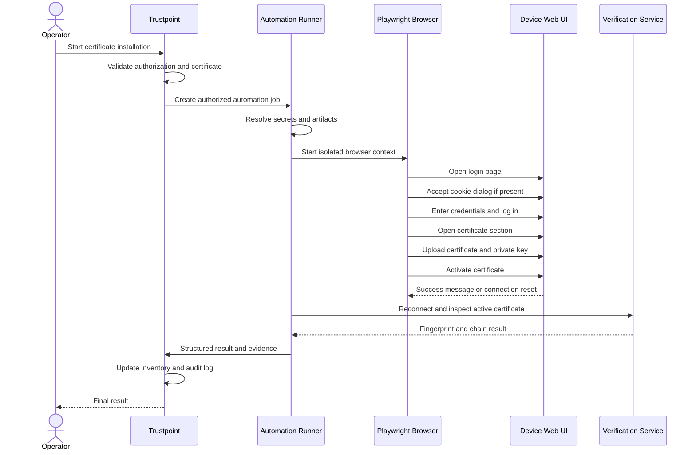
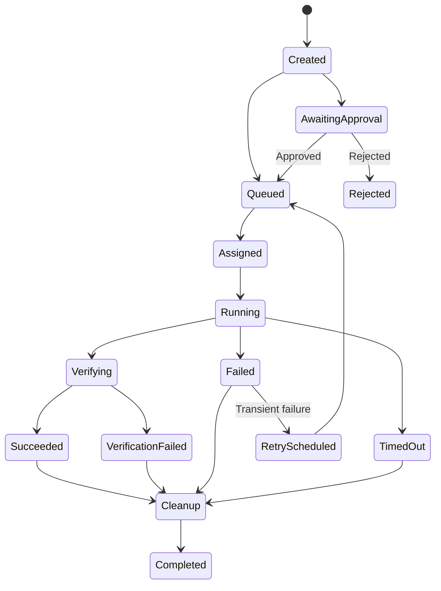
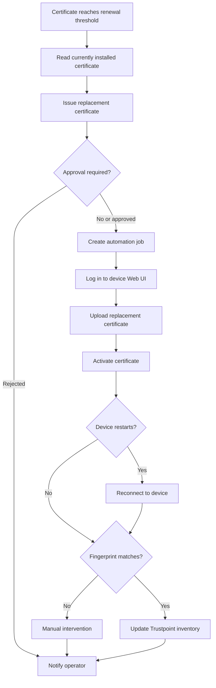

# Trustpoint Web UI Automation for Certificate Management

**Status:** Concept  
**Target:** Trustpoint  
**Proposed profile schema:** `trustpoint.web-automation.v1`

## 1. Purpose

Many industrial devices, controllers, gateways, and legacy systems support certificate management only through a browser-based management interface. They often provide neither a standardized enrollment protocol such as EST or CMP nor a usable management API.

Trustpoint should therefore support **Web UI automation** as a Brownfield integration mechanism. The automation behaves like an authorized human administrator:

1. Open the device Web Management interface.
2. Accept an optional cookie or consent dialog.
3. Authenticate with a dedicated automation account.
4. Navigate to the certificate-management section.
5. Generate, download, or upload certificate-related artifacts.
6. Activate the new certificate.
7. Verify that the intended certificate is actually in use.
8. Record the complete operation in the Trustpoint audit log.

The browser actions are described through a versioned JSON automation profile. This allows Trustpoint to support multiple vendors, device families, firmware versions, and user interfaces without implementing every workflow directly in the Trustpoint application code.

Web UI automation is a fallback mechanism. Standardized interfaces such as EST, CMP, ACME, OPC UA GDS, or vendor APIs should remain preferred whenever they are available.

## 2. Goals

The component should:

- automate certificate installation, renewal, replacement, inventory, and removal;
- support devices without standardized certificate-management interfaces;
- simulate the actions of an authorized administrator;
- use reusable vendor- and firmware-specific profiles;
- operate in segmented and air-gapped OT networks;
- protect credentials, certificates, private keys, and session data;
- verify the final device state independently;
- provide complete auditability;
- stop safely when the Web UI is unexpected;
- integrate with Trustpoint devices, domains, certificate profiles, workflows, and notifications.

## 3. Non-goals

The component is not intended to:

- replace standardized enrollment protocols;
- bypass MFA, CAPTCHA, or other security controls;
- automate unrelated device-administration tasks;
- execute unrestricted JavaScript, Python, shell commands, or operating-system processes from JSON;
- store plaintext credentials or private keys in automation profiles;
- disable TLS validation globally;
- guarantee compatibility with unknown firmware versions;
- use shared personal administrator accounts.

## 4. High-level architecture

The automation runtime should be separated from the Trustpoint web application process. It handles untrusted remote content, device credentials, and temporary certificate artifacts and should therefore run in an isolated environment.



### 4.1 Trustpoint server

The Trustpoint server is responsible for:

- device and domain management;
- certificate profile selection;
- certificate issuance;
- workflow scheduling;
- profile assignment;
- authorization and approvals;
- job creation;
- audit logging;
- result processing;
- notifications.

### 4.2 Web Automation Runner

The runner executes browser automation jobs. It may be deployed:

- alongside Trustpoint;
- as a separate container;
- on a dedicated automation host;
- inside an OT network segment;
- as a distributed runner serving a defined device group.

For segmented OT networks, a pull-based model is recommended. The runner establishes an authenticated outbound connection to Trustpoint, retrieves authorized jobs, executes them locally, and returns structured results.

### 4.3 Browser runtime

A browser automation framework such as Playwright should execute each job in a fresh browser context with:

- isolated sessions;
- deterministic browser settings;
- controlled upload and download directories;
- network restrictions;
- configurable timeouts;
- DOM-based locators;
- screenshots and traces;
- automatic cleanup.

### 4.4 Secret store

Device credentials must be stored separately from automation profiles. Profiles reference logical values such as:

- `device_username`
- `device_password`
- `pkcs12_password`
- `private_key_password`

These values are resolved at runtime from an authorized secret store.

### 4.5 Artifact service

Certificates, chains, CSRs, PKCS#12 packages, and private keys should be available to the runner only for the duration of a job.

The service should:

- authorize every retrieval;
- use short-lived access tokens;
- encrypt sensitive artifacts;
- create isolated per-job workspaces;
- remove temporary files after execution;
- prevent secrets from appearing in logs or screenshots.

## 5. Logical data model



## 6. Supported workflows

### 6.1 Initial certificate installation

Trustpoint issues a certificate and installs it through the device Web UI. Possible formats include:

- certificate and separate private key;
- PKCS#12 or PFX bundle;
- certificate chain;
- root CA or trust bundle.

### 6.2 Certificate renewal

Trustpoint:

1. reads the currently installed certificate;
2. creates or requests a replacement;
3. uploads the replacement;
4. activates it;
5. reconnects if the device restarts;
6. verifies the new fingerprint;
7. updates the Trustpoint inventory.

### 6.3 Device-generated key and CSR

Where supported, this is the preferred workflow:

1. Open the certificate-management page.
2. Trigger private-key generation on the device.
3. Generate and download a CSR.
4. Validate and sign the CSR in Trustpoint.
5. Upload the issued certificate.
6. Activate and verify it.

The private key remains on the device.

### 6.4 Trust-store update

Trustpoint uploads a root CA, intermediate CA, certificate chain, or trust list and verifies that it is present and active.

### 6.5 Certificate inventory

A read-only profile may extract:

- subject;
- issuer;
- serial number;
- validity period;
- fingerprint;
- key usage;
- certificate purpose;
- active or inactive state.

### 6.6 Decommissioning

Trustpoint removes managed certificates where supported and records the result.

## 7. Execution sequence



## 8. JSON automation profile

Profiles should use a declarative format and should not permit arbitrary code execution.

```json
{
  "schema": "trustpoint.web-automation.v1",
  "name": "Example Device HTTPS Certificate",
  "version": "1.0.0",
  "metadata": {
    "vendor": "Example Vendor",
    "device_family": "Example Gateway",
    "description": "Manage the HTTPS certificate through the device Web UI"
  },
  "compatibility": {
    "firmware": {
      "minimum": "3.2.0",
      "maximum_exclusive": "4.0.0"
    },
    "ui_languages": ["en", "de"]
  },
  "capabilities": [
    "certificate.inventory",
    "certificate.install",
    "certificate.renew"
  ],
  "inputs": {
    "endpoint": {
      "type": "url",
      "required": true
    },
    "username": {
      "type": "secret",
      "required": true
    },
    "password": {
      "type": "secret",
      "required": true
    },
    "certificate": {
      "type": "artifact",
      "artifact_type": "x509-certificate"
    },
    "private_key": {
      "type": "artifact",
      "artifact_type": "private-key",
      "sensitive": true
    }
  },
  "operations": {
    "certificate.install": {
      "steps": [
        {
          "id": "open-login",
          "action": "goto",
          "url": "{{ endpoint }}/login"
        },
        {
          "id": "accept-cookies",
          "action": "click_if_visible",
          "target": {
            "role": "button",
            "names": [
              "Accept all",
              "Alle akzeptieren",
              "Alles akzeptieren",
              "Ich stimme zu"
            ]
          }
        },
        {
          "id": "enter-username",
          "action": "fill",
          "target": {
            "selectors": [
              "[data-testid='username']",
              "#username",
              "input[name='username']"
            ]
          },
          "value": "{{ username }}",
          "sensitive": true
        },
        {
          "id": "enter-password",
          "action": "fill",
          "target": {
            "selectors": [
              "[data-testid='password']",
              "#password",
              "input[type='password']"
            ]
          },
          "value": "{{ password }}",
          "sensitive": true
        },
        {
          "id": "submit-login",
          "action": "press",
          "target": {
            "selectors": ["input[type='password']"]
          },
          "key": "Enter"
        },
        {
          "id": "open-certificate-management",
          "action": "click",
          "target": {
            "selectors": [
              "[data-testid='certificate-management']",
              "a[href*='certificates']"
            ]
          }
        },
        {
          "id": "upload-certificate",
          "action": "upload",
          "target": {
            "selectors": [
              "input[name='certificate']",
              "input[type='file'][accept*='certificate']"
            ]
          },
          "artifact": "{{ certificate }}"
        },
        {
          "id": "upload-private-key",
          "action": "upload",
          "target": {
            "selectors": [
              "input[name='private_key']",
              "input[type='file'][accept*='key']"
            ]
          },
          "artifact": "{{ private_key }}",
          "sensitive": true
        },
        {
          "id": "activate-certificate",
          "action": "click",
          "target": {
            "selectors": [
              "[data-testid='certificate-import-submit']",
              "button[type='submit']"
            ]
          }
        }
      ],
      "postconditions": [
        {
          "action": "verify_tls_certificate",
          "endpoint": "{{ endpoint }}",
          "expected_fingerprint": "{{ certificate.sha256_fingerprint }}"
        }
      ]
    }
  }
}
```

## 9. Supported action model

Only an allow-listed action set should be executable.

### Navigation

- `goto`
- `reload`
- `go_back`

### Interaction

- `click`
- `click_if_visible`
- `fill`
- `select`
- `check`
- `uncheck`
- `upload`
- `press`
- `focus`
- `hover`

### Synchronization

- `wait_for`
- `wait_for_navigation`
- `wait_for_download`
- `wait_for_network_idle`

### Assertions

- `assert_visible`
- `assert_hidden`
- `assert_enabled`
- `assert_text`
- `assert_url`
- `assert_attribute`
- `assert_variable`
- `assert_certificate`

### Data handling

- `extract_text`
- `extract_attribute`
- `extract_certificate`
- `download`
- `set_variable`

### Certificate-specific actions

- `verify_tls_certificate`
- `validate_certificate_chain`
- `validate_certificate_key_match`
- `validate_csr`
- `compare_fingerprint`

The following should be prohibited:

- arbitrary JavaScript;
- shell execution;
- operating-system commands;
- arbitrary local file access;
- unrestricted network requests;
- undeclared secret access.

## 10. Selector strategy

Selectors should be evaluated in the following order:

1. vendor-provided test or automation identifiers;
2. HTML element IDs;
3. form field names;
4. accessible roles and labels;
5. stable URLs and attributes;
6. CSS structure;
7. visible text;
8. XPath only as a last resort.

The runner should stop when:

- a security-relevant selector matches multiple elements;
- an expected page marker is missing;
- an unexpected dialog blocks the workflow;
- a control appears outside the expected page;
- an unexpected cross-origin frame is encountered;
- the UI no longer matches the approved profile.

## 11. Job lifecycle



### 11.1 Preflight

Before starting the browser, the runner verifies:

- profile signature and checksum;
- JSON Schema validity;
- firmware compatibility;
- endpoint allow-list;
- runner authorization;
- operation authorization;
- required inputs;
- certificate validity;
- certificate and private-key match;
- selected certificate profile;
- TLS trust policy.

### 11.2 Execution

Each step records:

- step ID;
- action type;
- start and end time;
- selected locator;
- retry count;
- result;
- sanitized message.

### 11.3 Verification

A successful click or success banner is not sufficient proof. Verification should use one or more independent mechanisms:

- inspect certificate data shown in the Web UI;
- reconnect to the HTTPS service;
- compare the SHA-256 fingerprint;
- verify the chain;
- verify the validity period;
- execute an application-specific health check;
- run a read-only inventory profile.

### 11.4 Cleanup

The runner must:

- close the browser context;
- delete downloads and uploads;
- invalidate temporary artifact tokens;
- remove session cookies and local storage;
- clear in-memory secrets;
- report cleanup status.

## 12. Certificate and private-key handling

Preferred order:

1. Device-generated private key and CSR
2. Private key generated in an isolated runner and transferred immediately
3. Import of an existing private key under explicit authorization

Trustpoint CA private keys must never be exposed to the Web UI automation runner.

Where a private key must be uploaded:

- use a per-job temporary directory;
- restrict file permissions;
- avoid persistent storage;
- encrypt artifacts at rest and in transit;
- use password-protected PKCS#12 where supported;
- exclude sensitive values from logs and evidence;
- delete files immediately after upload.

Before upload, Trustpoint should validate:

- certificate parsing;
- device association;
- subject and SAN compliance;
- validity period;
- issuer and chain;
- key usage and extended key usage;
- certificate and private-key match;
- certificate-profile compliance.

## 13. Authentication and account management

Each endpoint should use a dedicated automation account where supported.

The account should:

- have only certificate-management permissions;
- not be a personal user account;
- not use default credentials;
- be unique per device or group where practical;
- support password rotation;
- be disabled when the integration is removed;
- be monitored for unexpected interactive use.

MFA must not be bypassed. If a device requires non-automatable MFA, the workflow should require human assistance or use another supported interface.

## 14. TLS and network security

Supported trust policies may include:

- configured CA trust store;
- certificate fingerprint pinning;
- approved trust-on-first-use during onboarding;
- temporary bootstrap-certificate acceptance followed by replacement and pinning.

A general `ignore_https_errors` option should not be available in production profiles.

Additional restrictions should include:

- HTTPS by default;
- explicit approval for HTTP bootstrap workflows;
- host and port allow-lists;
- same-origin redirects;
- blocking unrelated external requests;
- DNS-rebinding protection;
- egress firewall restrictions;
- blocking loopback and metadata endpoints.

## 15. Reliability and idempotency

Every operation should define:

- how the current device state is detected;
- whether the target certificate is already installed;
- whether re-execution is safe;
- which steps are destructive;
- whether rollback is possible;
- how partial completion is detected.

Recommended outcomes:

- `succeeded`
- `already_compliant`
- `failed`
- `partially_completed`
- `verification_failed`
- `incompatible_profile`
- `authentication_failed`
- `manual_intervention_required`
- `timed_out`
- `cancelled`

Retries should be limited to transient failures such as page-load errors, connection resets, delayed restarts, or delayed certificate activation.

## 16. Renewal workflow



## 17. Profile governance

Automation profiles are executable security configuration and require governance.

Each profile should include:

- unique identifier;
- semantic version;
- maintainer;
- supported firmware range;
- review status;
- checksum;
- optional digital signature;
- test results;
- changelog;
- deprecation status.

Recommended states:

1. Draft
2. Validated
3. Approved
4. Active
5. Deprecated
6. Revoked

Every job must store the exact profile version and checksum used.

## 18. Audit logging and evidence

Trustpoint should record:

- initiating user, service account, or workflow;
- approval decision;
- device and endpoint;
- runner identity;
- profile version and checksum;
- certificate identifier and fingerprint;
- operation type;
- start and end time;
- step-level status;
- verification result;
- retry attempts;
- failure category;
- cleanup result.

Evidence handling requirements:

- disable screenshots during password entry;
- redact sensitive inputs;
- never capture private keys or passwords;
- configure retention periods;
- restrict evidence access;
- integrity-protect evidence files.

## 19. Trustpoint user interface

### Automation profiles

- list profiles;
- import and export JSON;
- validate profiles;
- compare versions;
- approve, deprecate, or revoke profiles;
- view firmware compatibility;
- run profile tests.

### Managed endpoints

- assign a profile to a device;
- configure endpoint URL;
- configure TLS trust;
- bind secret references;
- select a runner;
- define permitted operations;
- test connectivity;
- execute certificate inventory.

### Automation jobs

- view active and completed jobs;
- inspect step-level execution;
- cancel jobs;
- approve sensitive operations;
- retry eligible jobs;
- inspect sanitized evidence;
- mark manual intervention.

### Device certificate view

- expected certificate;
- observed certificate;
- last verification;
- assigned profile;
- renewal status;
- compliance status;
- next planned action.

## 20. API proposal

```text
/api/web-automation/profiles/
/api/web-automation/endpoints/
/api/web-automation/runners/
/api/web-automation/jobs/
/api/web-automation/jobs/{id}/results/
/api/devices/{id}/web-endpoints/
/api/devices/{id}/certificate-state/
```

Sensitive values must not be returned through the API. Responses should contain only secret references and redacted metadata.

## 21. Testing strategy

### Schema tests

- valid and invalid profiles;
- unknown actions;
- literal secret detection;
- invalid selectors;
- unsupported schema versions;
- unsafe URLs;
- missing verification steps.

### Simulated device tests

Provide mock Web Management applications for:

- simple HTML login;
- cookie banners;
- JavaScript single-page applications;
- certificate and private-key upload;
- PKCS#12 upload;
- CSR generation and download;
- delayed activation;
- device restart;
- changed UI structure;
- authentication failure.

### Security tests

- secret leakage into logs;
- screenshot leakage;
- path traversal;
- malicious filenames;
- profile tampering;
- SSRF;
- DNS rebinding;
- redirects to external hosts;
- oversized downloads;
- concurrent jobs;
- runner isolation.

## 22. Concurrency controls

Only one certificate-changing job should run against a device endpoint at a time. Locks should be based on:

- device;
- endpoint;
- certificate purpose.

Read-only inventory may run concurrently only when explicitly permitted.

## 23. Compatibility management

Each profile must declare a firmware compatibility range. Compatibility may be detected through:

- configured firmware version;
- page metadata;
- visible version information;
- DOM markers;
- management endpoints;
- characteristic page elements.

If compatibility cannot be established, the runner should stop before making changes.

| Vendor | Device family | Firmware | Profile | Operations | Status |
|---|---|---:|---:|---|---|
| Generic | WBM device | 1.x | `wbm-generic` 1.0 | Login test | Experimental |
| Siemens | Industrial Edge Device | Declared versions | `wbm-siemens-edge` 1.x | Certificate import | Experimental |
| Example Vendor | Gateway X | 3.2-3.x | `gateway-x-https` 1.0 | Inventory, install, renew | Validated |

## 24. Recommended implementation phases

### Phase 1: MVP

- Playwright-based runner;
- visit a configured URL;
- accept optional cookie dialogs;
- enter credentials;
- navigate using JSON-defined steps;
- upload a certificate;
- record execution logs;
- run against a simulated device.

### Phase 2: Secure certificate installation

- isolated artifact workspace;
- secret references;
- certificate and private-key upload;
- PKCS#12 support;
- post-installation fingerprint verification;
- audit integration;
- sanitized screenshots.

### Phase 3: Lifecycle management

- certificate inventory;
- scheduled renewal;
- device-generated CSR workflows;
- trust-store management;
- approval workflows;
- notifications.

### Phase 4: Distributed OT runners

- pull-based job retrieval;
- runner assignment by network segment;
- runner health monitoring;
- signed profile distribution;
- controlled runner updates.

### Phase 5: Vendor profile ecosystem

- profile development kit;
- test harness;
- compatibility certification;
- signed profile packages;
- contribution and review process.

## 25. MVP reference implementation

```python
from playwright.sync_api import sync_playwright


def main() -> None:
    with sync_playwright() as playwright:
        browser = playwright.chromium.launch(headless=False)
        page = browser.new_page()

        page.goto("https://www.google.com/")

        cookie_button = page.get_by_role(
            "button",
            name="Accept all",
        )

        if cookie_button.is_visible():
            cookie_button.click()

        search_box = page.locator(
            'textarea[name="q"], input[name="q"]'
        ).first

        search_box.fill("Trustpoint certificate management")
        search_box.press("Enter")

        input("Press Enter to close the browser...")
        browser.close()


if __name__ == "__main__":
    main()
```

The next implementation step is to replace the hard-coded actions with a JSON profile and a generic allow-listed action executor.

## 26. Key design decisions

1. Web UI automation is a Brownfield fallback mechanism.
2. Browser execution is separated from the Trustpoint web process.
3. Profiles are declarative, versioned, validated, and restricted.
4. Credentials and private keys are never stored directly in profile JSON.
5. Device-generated keys and CSRs are preferred.
6. Success messages alone are not sufficient verification.
7. Every certificate-changing operation requires an independent postcondition.
8. TLS validation may be configured per endpoint but not globally disabled.
9. Profiles are tied to explicit firmware versions.
10. Every execution is attributable and auditable.
11. Distributed runners should use a pull model.
12. Unexpected UI changes result in a safe stop.

## 27. Definition of done

An initial Trustpoint release is complete when it can:

- register an isolated automation runner;
- import and validate a JSON profile;
- assign the profile to a device;
- bind device credentials securely;
- issue a certificate;
- transfer certificate artifacts through an ephemeral channel;
- execute login, navigation, upload, activation, and logout;
- accept optional cookie or consent dialogs;
- independently verify the installed TLS certificate fingerprint;
- record a sanitized audit trail;
- remove temporary sensitive material;
- classify authentication, compatibility, upload, and verification failures;
- demonstrate the workflow against a simulated device and one representative industrial device.
